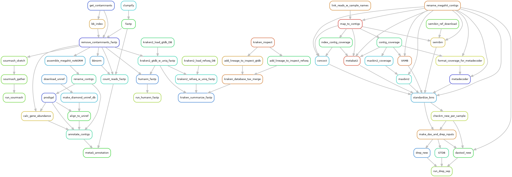

# GLAMR: The Great Lakes Atlas of Multi-omics Research
This repository contains the pipleines that power the GLAMR database.

GLAMR is designed to be a centralized resource housing Great Lakes omics datasets analyzed with standardized pipelines and integrated with environmental data. 

## Folder structure
```
GLAMR
├── code (scripts)
├── pypelib (Python modules)
├── config
│   ├── conda_yaml (for installing software dependencies)
│   └── profiles (for snakemake)
├── data
│   ├── omics [primary data directory]
│   │   └── {sample_type}
|   |       └── {sample_directories}
│   ├── projects [links to directories in the data/omics folder]
|   |   └── project_name
|   |       └── {sample_type}
|   |           └── {symlinks to sample_directories}
│   ├── reference
│   │   ├── amplicons
│   │   ├── genomes
│   │   ├── MAGs
│   │   └── UMRAD
│   ├── sample_metadata
|   └──environment
├── ReadMe.md
└── Snakefile
```

## Snakemake
Snakemake is used extensively to manage the workflows used in this database. A conda environment including dependencies required to execute the pipeline can be found at [config/conda_yaml/snakemake.yaml](config/conda_yaml/snakemake.yaml) and can be installed with:

```
conda env create -f config/conda_yaml/snakemake.yaml
```

And activated with:
```
conda activate snakemake
```

Individual rule dependencies are managed with conda and singularity (primarily for R code). To use snakemake's dependency management, it must be run with `--sdm conda apptainer`. Running snakemake with [profiles](https://snakemake.readthedocs.io/en/stable/executing/cli.html#profiles) that can be used to specify a commonly used set of otions like this is encouraged, examples can be found [here](https://github.com/Geo-omics/snakemake_profiles).

## Pipeline overview


## To Add:
- Instructions for importing samples
- Instructions for running individual pipelines and all pipelines together
