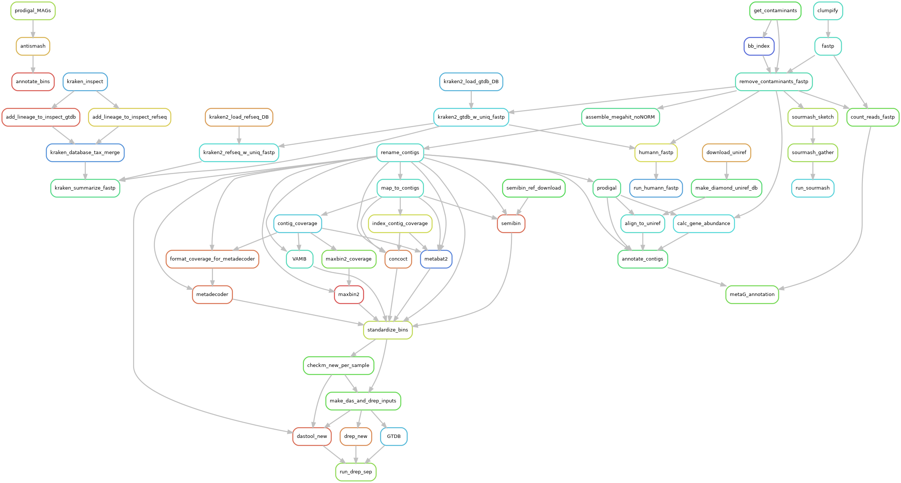

# GLAMR: The Great Lakes Atlas of Multi-omics Research
This repository contains the pipleines that power the GLAMR database.

GLAMR is designed to be a centralized resource housing Great Lakes omics datasets analyzed with standardized pipelines and integrated with environmental data. 

## Folder structure
```
GLAMR
├── code
├── config
│   ├── conda_yaml (for installing software dependencies)
│   └── profiles (for snakemake)
├── data
│   ├── omics [primary data directory]
│   │   └── {sample_type}
|   |       └── {sample_directories}
│   ├── projects [links to directories in the data/omics folder]
|   |   └── project_name
|   |       └── {sample_type}
|   |           └── {sample_directories}
│   ├── reference
│   │   ├── amplicons
│   │   ├── genomes
│   │   ├── MAGs
│   │   └── UMRAD
│   |── sample_metadata
|   └──environment
└── ReadMe.md
```

## Snakemake
Snakemake is used extensively to manage the workflows used in this database. 

## Pipeline overview


## To Add:
- Instructions for importing samples
- Instructions for running individual pipelines and all pipelines together